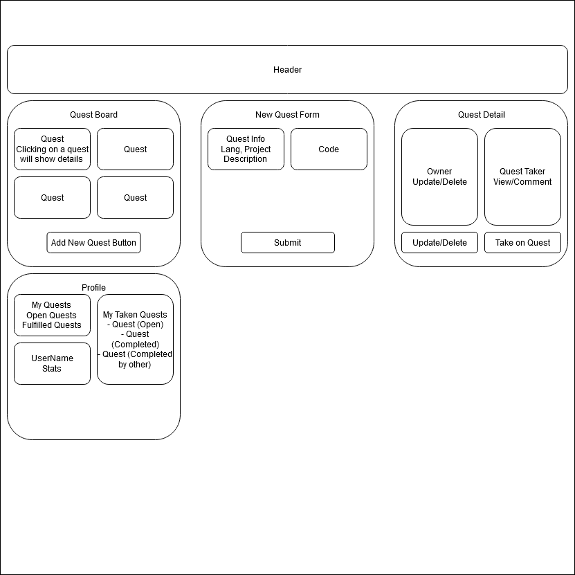

# Code Quest

#### React and JavaScript Capstone Exercise for Epicodus, 10.05.2020

## By Jeff Kim

## Description

This capstone project is designed to present the concept of StackOverflow and other such code help sites and present it in a highly gamified form. The format will be similar to an RPG quest board, where users will be able to post code help requests in the form of "quests". Users can post details related to their quest, such as their preferred coding language, project objectives/details, and any additional goals they may have. Users who post quests can also post a "bounty", which will be a reward of virtual currency that will be given to the first person who successfully completes the code request.

Users will earn this currency by (obviously) completing quests, but will also have methods to earn currency passively so that no one will ever be left without the ability to post or complete requests. Daily activities such as quizzes, user participation events, and other interactions will allow them to earn and save nominal amounts of currency so that the community will remain accessible to anyone, regardless of their skill level. Beyond that, currency use can be extrapolated to any number of stretch features, such as promoting your own quest or adding onto the bounty of a quest you would like to know the answer to, as well. Eventually, corporate sponsors may even be able to introduce "Legendary Quests" similar to bug bounties that require community participation to complete.



This project was bootstrapped with [Create React App](https://github.com/facebook/create-react-app).

## Specifications

| Behavior | Input | Output |  Completed(Y/N?)  |
| -------- | ----- | ------ | -------- |
| Create a quest object | Click **Add Quest** button | A new quest object is created | N |
| Add the new quest object to a master list | N/A | Quest is added to the master list of quests and displayed on the page | N |
| Click a quest to see its details | Click a quest div on the master quest list | Load quest details component | N |
| Claim a quest to work on | Click the **Claim Quest** button on a quest details page | Quest is added to a list of your active quests | N |
| Solve a quest | Enter a solution in a text/code editor block and click the **Submit** button on an active quest | Your solution is posted to the quest details page | N |
| Complete a quest | Click the **Accept Solution** button on the quest details page of a quest you own | Quest is marked as *Complete* | N |

## Setup/Installation Requirements

**Requirements:**
* [Node JS - Latest Version](https://nodejs.org/en/)

**To use this program:**

1. Open your preferred browser.
2. Navigate to https://github.com/jkbutserious/code-quest.git.
3. Click the **Code** button and click **Download ZIP** to clone the repository to your computer.
4. Open the Windows PowerShell console, VS Code Bash terminal, or the MacOS Terminal and use the ``cd [YOUR DOWNLOAD FILEPATH]/code-quest`` command to navigate to the Factory subdirectory.
5. Use the ``npm run start`` command to run the program.
6. Use the web interface to add kegs to the list and keep track of the pints left.
7. If you have any issues running this program, please reach out to the developer or troubleshoot at your own risk.

**To contribute to this project:**

1. Open your preferred browser.
2. Navigate to https://github.com/jkbutserious/code-quest.
3. Log into or sign up for your GitHub account.
4. Click the **Fork** button to copy the repository and all source code.
5. From your forked repository, you can download or clone the repository, by clicking the **Code** button.
  * To clone the repository in Visual Studio Code's terminal, use the command

    ```git clone https://github.com/[YOUR-USER-NAME-HERE]/code-quest```
  * To clone the repository in GitHub Desktop, click the **Open in Desktop** option
  * To download the repository, click the **Download ZIP** option, save the archive to your computer, and extract it to the folder of your choice
6. Use your preferred code editor to edit the appropriate script files.
7. Save any changes you make in your code editor and use your preferred git solution to commit your changes.
8. Push your changes to your forked repository.

## Available Scripts

In the project directory, you can run:

### `npm start`

Runs the app in the development mode.<br />
Open [http://localhost:3000](http://localhost:3000) to view it in the browser.

The page will reload if you make edits.<br />
You will also see any lint errors in the console.

### `npm test`

Launches the test runner in the interactive watch mode.<br />
See the section about [running tests](https://facebook.github.io/create-react-app/docs/running-tests) for more information.

### `npm run build`

Builds the app for production to the `build` folder.<br />
It correctly bundles React in production mode and optimizes the build for the best performance.

The build is minified and the filenames include the hashes.<br />
Your app is ready to be deployed!

See the section about [deployment](https://facebook.github.io/create-react-app/docs/deployment) for more information.

### `npm run eject`

**Note: this is a one-way operation. Once you `eject`, you can’t go back!**

If you aren’t satisfied with the build tool and configuration choices, you can `eject` at any time. This command will remove the single build dependency from your project.

Instead, it will copy all the configuration files and the transitive dependencies (webpack, Babel, ESLint, etc) right into your project so you have full control over them. All of the commands except `eject` will still work, but they will point to the copied scripts so you can tweak them. At this point you’re on your own.

You don’t have to ever use `eject`. The curated feature set is suitable for small and middle deployments, and you shouldn’t feel obligated to use this feature. However we understand that this tool wouldn’t be useful if you couldn’t customize it when you are ready for it.

## Learn More

You can learn more in the [Create React App documentation](https://facebook.github.io/create-react-app/docs/getting-started).

To learn React, check out the [React documentation](https://reactjs.org/).

### Code Splitting

This section has moved here: https://facebook.github.io/create-react-app/docs/code-splitting

### Analyzing the Bundle Size

This section has moved here: https://facebook.github.io/create-react-app/docs/analyzing-the-bundle-size

### Making a Progressive Web App

This section has moved here: https://facebook.github.io/create-react-app/docs/making-a-progressive-web-app

### Advanced Configuration

This section has moved here: https://facebook.github.io/create-react-app/docs/advanced-configuration

### Deployment

This section has moved here: https://facebook.github.io/create-react-app/docs/deployment

### `npm run build` fails to minify

This section has moved here: https://facebook.github.io/create-react-app/docs/troubleshooting#npm-run-build-fails-to-minify
#### Additional Setup/Installation Notes:

* No additional code  or installations are necessary to view this project.   

## Known Bugs

_No known issues. Please contact me if you have any problems._


## Support and contact details

To report any issues with this page or to contribute to this project, contact Jeff Kim at kim2jy@hotmail.com.

## Technologies Used

* JavaScript
* React
* Redux
* Node JS
* Visual Studio Code 
* Git and Git BASH 


### License

Copyright © 2020 Jeffrey Kim